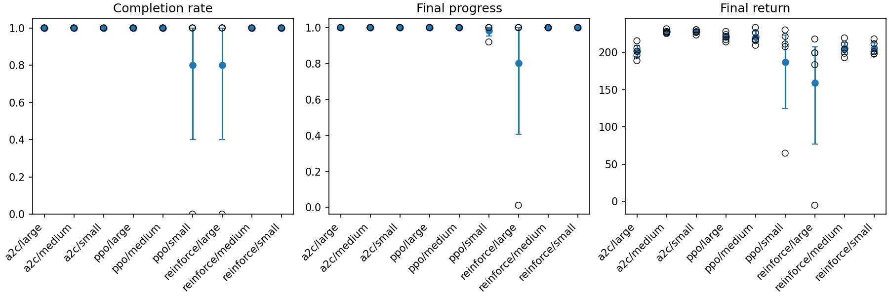
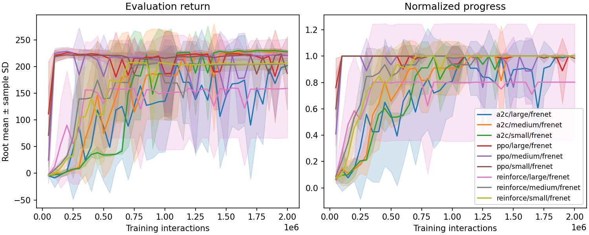
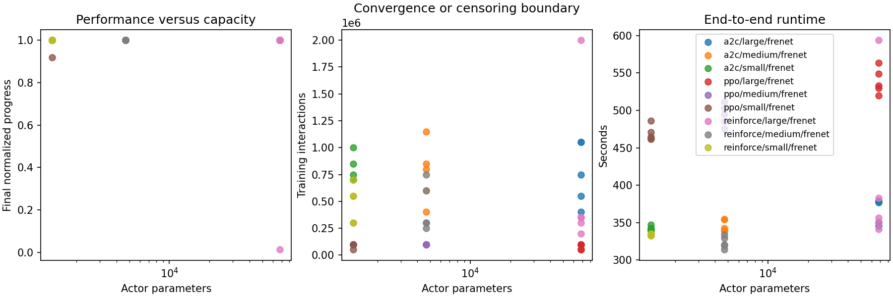
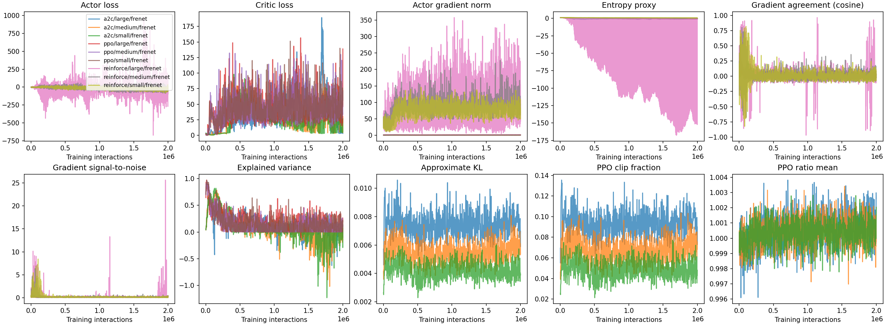
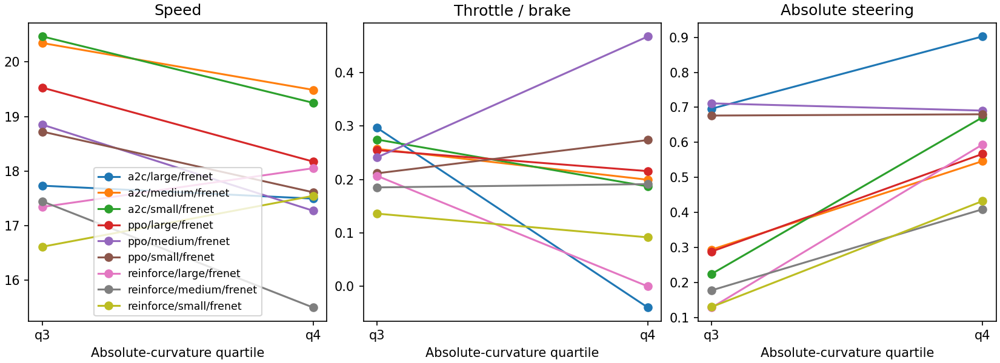

# Experiment 1 — Actor size on one circuit

> How does actor-network capacity affect final driving performance, interaction
> efficiency, convergence reliability and computational cost on one fixed
> circuit?

This is the reported outcome of the Experiment 1 section of
[`EXPERIMENT.md`](EXPERIMENT.md). That document fixes the design and was frozen
before any of these runs started; this one records what happened. It does not
restate the learning rules: the bounded Gaussian policy, the return conventions
and the optimizer contract are in [`LEARNING.md`](LEARNING.md), and the racing
MDP and circuit model are in [`MDP.md`](MDP.md) and [`TRACK.md`](TRACK.md).

**Status:** complete. 45 runs, 0 failed, 316.7 minutes of wall time.
Reproduce with

```
python experiments/experiment_1.py run
```

which is resumable and contract-checked: an interrupted matrix continues where
it stopped, and a run recorded under superseded constants is re-run rather than
reused. Every table and figure below is regenerated from the raw run records by
`analyze_results` and written to disk before it is read. Console output and
hand-copied values are not authoritative; the files under
`results/analysis/reported_experiments/experiment_1/` are. The figures here are
copies of those files, kept in `figures/experiment_1/` because `results/` is not
tracked by git.

## What is being varied, and what is not

One thing changes across the matrix: the width of the two hidden layers of the
actor. Everything else — circuit, observation, reward, physics, episode limit,
critic width, learning rate, interaction budget, evaluation schedule — is held
fixed, so a difference in outcome is attributable to capacity rather than to the
conditions around it.

The algorithm comparison is **secondary**. Running the same size ladder under
REINFORCE, A2C+GAE and PPO describes the practical effect of adding a critic,
GAE and bounded sample reuse, but the protocol does not assume that the more
elaborate algorithm must win, and contrary evidence is reported as it is found.

## Hypotheses

The protocol commits to four, none of which asserts a direction for capacity:

- **Capacity.** Actor size can change final task performance; larger is *not*
  assumed to be better.
- **Efficiency.** Actor size can change the interactions and the computation
  needed to reach the task threshold. These are two different costs and are
  reported separately.
- **Reliability.** Actor size can change the fraction of roots that learn a
  stable lap-completing policy. With five roots this is a count out of five and
  is always reported as such.
- **Algorithm.** A2C+GAE and PPO are expected to reduce variance or improve
  sample use relative to REINFORCE.

What each one got is answered in [Verdict on the hypotheses](#verdict-on-the-hypotheses).

## Design matrix

One independent unit is a complete training run identified by
$(\text{algorithm}, \text{actor size}, \text{root identity})$.
$3 \times 3 \times 5 = 45$ runs. Root identities `0..4` are **paired across
actor sizes and algorithms**: root 2 names the same derived seed streams wherever
it appears, so a within-root difference removes the root-to-root variation that
otherwise dominates a five-sample comparison.

## Fixed conditions

Every run uses the saved `tracks/experiment_1.json` circuit and its canonical
start; the Frenet observation $(d_t, \phi_{e,t}, v_t, \delta_t, \bar\kappa_t)$;
the same action mapping, reward, episode limit and frozen physics version; one
fixed `(64, 64)` critic for A2C and PPO; the learning rate selected for its
algorithm before the experiment; 2,000,000 training interactions; deterministic
evaluation every 50,000 interactions; and checkpoints every 250,000 interactions
and at the final budget.

**Selected learning rates** (from the pre-experiment configuration check, a
separate exercise recorded in `EXPERIMENT.md`): REINFORCE $10^{-3}$; A2C
$(10^{-3}, 3\cdot 10^{-3})$; PPO $(3\cdot 10^{-4}, 10^{-2})$.

**One interaction is one call to `RacingEnv.step`**, whatever happens inside it.
Evaluation interactions are counted separately and never enter the training
budget.

## Evaluation and the convergence rule

Evaluation runs the deterministic policy $A_t = \tanh(\mu_\theta(O_t))$ from the
canonical start at zero speed, even though training samples its start pose all
around the circuit. **Stable convergence** is the first of three consecutive
evaluations that complete the lap in at most $34$ simulated seconds — about
$1.5\times$ the reference controller's $22.3\,\mathrm{s}$ average. It is a
project choice, not a measurement. A run that never meets it is
**right-censored** at the budget and stays in every summary.

---

# Result 1 — Configuration and parameter counts

| Actor | Hidden widths | Actor parameters | Critic parameters | Total (A2C / PPO) |
|---|---|---:|---:|---:|
| small | `(32, 32)` | 1,316 | 4,609 | 5,925 |
| medium | `(64, 64)` | 4,676 | 4,609 | 9,285 |
| large | `(256, 256)` | 67,844 | 4,609 | 72,453 |

REINFORCE has no critic, so its totals are the actor counts alone.

**Analysis.** The ladder spans $51\times$ in actor parameters, and the steps are
uneven on purpose: small→medium is $3.6\times$, medium→large is $14.5\times$.
Any capacity effect should therefore show up far more strongly in the second
step than the first, and that is exactly the shape of every result below. Note
also that the fixed critic is *larger than two of the three actors*: at the small
and medium sizes an A2C or PPO agent carries more value parameters than policy
parameters. That is a deliberate control — it keeps critic capacity from varying
with the factor under study — but it means "actor size" and "share of the model
devoted to the actor" move together, and the large cell is the only one where
the actor dominates the model.

# Results 2 and 3 — Final task metrics and completion counts

Means over five roots, with the sample standard deviation and an exhaustive
root-bootstrap 95% interval. Lap time is the mean over roots that completed.

| Algorithm | Actor | Laps | Final return | SD | 95% interval | Progress | Converged | Lap time (s) |
|---|---|---:|---:|---:|---|---:|---:|---:|
| REINFORCE | small | 5/5 | 205.49 | 9.05 | 198.8 – 213.0 | 1.000 | 5/5 | 29.88 |
| REINFORCE | medium | 5/5 | 205.31 | 10.34 | 197.6 – 213.7 | 1.000 | 5/5 | 29.92 |
| REINFORCE | large | **4/5** | 159.06 | 92.65 | 76.6 – 207.4 | 0.803 | **4/5** | 31.08 |
| A2C | small | 5/5 | 227.84 | 2.92 | 225.5 – 230.0 | 1.000 | 5/5 | **24.91** |
| A2C | medium | 5/5 | **227.98** | 2.40 | 226.4 – 230.0 | 1.000 | 5/5 | **24.90** |
| A2C | large | 5/5 | 201.67 | 10.02 | 194.1 – 209.8 | 1.000 | 5/5 | 30.74 |
| PPO | small | **4/5** | 187.15 | 69.00 | 124.7 – 223.3 | 0.984 | 5/5 | 27.16 |
| PPO | medium | 5/5 | 220.61 | 9.42 | 213.7 – 228.6 | 1.000 | 5/5 | 26.52 |
| PPO | large | 5/5 | 220.97 | 5.51 | 216.8 – 225.2 | 1.000 | 5/5 | 26.45 |



**Analysis.** Forty-three of forty-five runs finish the lap from the canonical
start. The task is solved, and the interesting variation is in *how fast* and
*how reliably* rather than in whether.

The best cell is **A2C at small or medium**, at 227.9 return and a 24.9-second
lap, and the two are indistinguishable from each other. The worst non-degenerate
cell is A2C at large, which laps every root but takes **5.8 seconds longer** to
do it. That is not a small effect: it is a quarter again the lap time, from the
same algorithm and the same budget, with only the actor width changed.

Two cells lose a root, and the two failures are not the same kind of thing.
The dot plot makes this visible — both `reinforce/large` and `ppo/small` show
four points clustered with the rest and one far below — but the raw records say
they are different failures, and [the two lost roots](#the-two-lost-roots)
separates them. Read the standard deviations with that in mind: the 92.65 and
69.00 in this table are one-outlier artifacts, not descriptions of spread. Every
cell whose five roots all lapped has an SD between 2.40 and 10.34.

The SD column also contains the cleanest incidental finding in the table: **A2C
at small and medium is the most repeatable configuration in the experiment**, at
2.92 and 2.40 against 5.51–10.34 everywhere else. It is simultaneously the
fastest and the least variable.

# Result 4 — Learning curves



**Analysis.** The three algorithms have visibly different shapes, and the shapes
matter more than the endpoints.

**PPO rises almost immediately** and then stays flat: every PPO cell is at
roughly its final return within 100,000–150,000 interactions, which is 5–7% of
the budget. The remaining 93% buys it very little. **REINFORCE** climbs over
roughly 250,000–500,000 interactions to a plateau near 205. **A2C is the slowest
to rise** — still improving past 1,000,000 interactions — but it rises *past*
the other two and finishes highest. If the budget had been 250,000 interactions
this experiment would have concluded that PPO dominates and A2C is the weakest of
the three; at 2,000,000 the ordering at the best size is reversed.

That is worth stating plainly because it is the same trap the pre-experiment
calibration fell into. The learning-rate check ran REINFORCE and PPO at 250,000
interactions and A2C at 750,000, and its rankings do not predict this table.
**A short-budget ranking of these algorithms is not a ranking.**

The right panel shows why the return curves are noisy while the task is solved:
normalized progress saturates at 1.0 early for most cells and stays there, so
the wobble in return is variation in *lap time and step cost*, not in whether the
car finishes. The two exceptions are visible as flat lines below 1.0 —
`reinforce/large` pinned near 0.80 (four of five roots at 1.0, one at 0.01) and
`a2c/large` swinging widely through the second half.

# Result 5 — Convergence, cost and censoring

Interactions to stable convergence, per root:

| Algorithm | Actor | Roots converged | Interactions to convergence | Episodes to convergence |
|---|---:|---:|---|---:|
| REINFORCE | small | 5/5 | 300k – 700k | 1,664 |
| REINFORCE | medium | 5/5 | 250k – 750k | 1,317 |
| REINFORCE | large | 4/5 | 200k – 350k, one censored | 1,087 |
| A2C | small | 5/5 | 700k – 1,000k | 2,544 |
| A2C | medium | 5/5 | 400k – 1,150k | 2,951 |
| A2C | large | 5/5 | 400k – 1,050k | 5,199 |
| PPO | small | 5/5 | **50k – 100k** | 300 |
| PPO | medium | 5/5 | **100k** | 336 |
| PPO | large | 5/5 | **50k – 100k** | 245 |



**Analysis.** On interactions-to-threshold, **PPO wins by an order of
magnitude** — 50,000–100,000 against REINFORCE's 200,000–750,000 and A2C's
400,000–1,150,000. Its 245–336 episodes to convergence against A2C's 2,544–5,199
is the sample-reuse argument for PPO showing up exactly where the theory says it
should.

But convergence here means *crossing the 34-second threshold*, and that threshold
is generous: 1.5× the reference controller. Crossing it early is not the same as
driving well. PPO crosses first and then improves very little; A2C crosses last
and keeps improving to a better final policy. **Which algorithm is "efficient"
depends entirely on whether the question is time-to-adequate or quality-at-budget**,
and this experiment answers them differently.

Note also that PPO's convergence points cluster at exactly 50k and 100k — the
first and second evaluation checkpoints. The measurement is saturated at its own
resolution: PPO converges somewhere inside the first 100,000 interactions and
the 50,000-interaction evaluation grid cannot say where. Any finer comparison
among PPO cells on this metric is not supported by the data.

The A2C large cell converges in a similar interaction range to A2C medium
(400k–1,050k) but needs 5,199 episodes against 2,951 — its episodes are shorter,
which is consistent with a policy that is crashing and restarting more during
training and, as Result 9 shows, driving more slowly at the end.

# Result 6 — Performance and cost against actor parameter count

The paired contrasts are the strongest evidence in the experiment, because root
identities are shared: each difference is computed within a root and then
summarized over the five, which removes the root-to-root variation that
dominates a five-sample comparison.

**Size effects, holding the algorithm fixed** (positive favours the first named):

| Algorithm | Contrast | Δ return | 95% interval | Verdict |
|---|---|---:|---|---|
| A2C | medium − large | **+26.31** | 18.7 – 32.4 | interval excludes 0 |
| A2C | small − large | **+26.17** | 15.8 – 35.0 | interval excludes 0 |
| A2C | small − medium | −0.13 | −3.4 – 3.0 | indistinguishable |
| PPO | medium − large | −0.36 | −9.2 – 8.5 | indistinguishable |
| PPO | small − large | −33.83 | −95.5 – 5.0 | includes 0 |
| PPO | small − medium | −33.47 | −92.7 – 0.2 | includes 0 |
| REINFORCE | medium − large | +46.26 | −2.1 – 127.2 | includes 0 |
| REINFORCE | small − large | +46.43 | 0.1 – 127.3 | excludes 0, barely |
| REINFORCE | small − medium | +0.17 | −12.6 – 13.0 | indistinguishable |

**Algorithm effects, holding the size fixed:**

| Actor | Contrast | Δ return | 95% interval |
|---|---|---:|---|
| small | A2C − PPO | +40.69 | 3.6 – 104.2 |
| medium | A2C − PPO | +7.36 | 0.9 – 13.8 |
| large | A2C − PPO | −19.31 | −24.9 – −12.1 |
| small | REINFORCE − A2C | −22.35 | −29.8 – −14.9 |
| medium | REINFORCE − A2C | −22.66 | −30.2 – −13.5 |
| large | REINFORCE − A2C | −42.61 | −126.7 – 11.6 |
| small | REINFORCE − PPO | +18.34 | −22.9 – 87.6 |
| medium | REINFORCE − PPO | −15.30 | −19.7 – −10.3 |
| large | REINFORCE − PPO | −61.92 | −149.9 – −10.0 |

**Analysis.** The capacity effect is real, it is negative, and **it is not the
same for every algorithm**.

For **A2C** the evidence is unambiguous: going from either smaller actor to the
large one costs about 26 points of return, with intervals that exclude zero and
do not overlap it closely. Small and medium are statistically identical
(−0.13, interval ±3). A2C's response to capacity is a step function — fine up to
4,676 parameters, clearly worse at 67,844.

For **PPO** the picture is the opposite in shape: medium and large are
indistinguishable (−0.36, interval ±9), and the apparent small-actor deficit of
−33.8 has an interval spanning zero because it rests on one root. **PPO is the
capacity-insensitive algorithm here**, at least from medium upward.

For **REINFORCE** the large-actor deficit is the largest point estimate in the
table (+46) but the widest interval, for the same reason: it is one dead root
doing the work. The honest reading is that REINFORCE at large is *unreliable*
rather than *slow* — the four roots that worked returned 183–218, in line with
its other cells.

On the algorithm axis, A2C beats PPO at small and medium and loses to it at
large, and every one of those three intervals excludes zero. That is a genuine
interaction between the two factors, not a main effect: **there is no algorithm
that is best at every size, and no size that is best for every algorithm.**
REINFORCE is last or tied-last everywhere except against PPO's damaged small
cell.

# Result 7 — Throughput, memory and end-to-end runtime

Per-run means over five roots.

| Algorithm | Actor | Collection (min) | Optimization (min) | Evaluation (min) | End-to-end (min) | Throughput (step/s) | Peak memory (MB) |
|---|---|---:|---:|---:|---:|---:|---:|
| REINFORCE | small | 5.0 | 0.2 | 0.1 | 5.6 | 6,658 | 805 |
| REINFORCE | medium | 4.8 | 0.3 | 0.1 | 5.4 | 6,899 | 812 |
| REINFORCE | large | 5.7 | 0.5 | 0.1 | 6.7 | 6,012 | 911 |
| A2C | small | 5.0 | 0.4 | 0.1 | 5.7 | 6,626 | 1,060 |
| A2C | medium | 5.1 | 0.4 | 0.1 | 5.8 | 6,581 | 1,060 |
| A2C | large | 5.1 | 0.7 | 0.1 | 6.1 | 6,566 | 1,060 |
| PPO | small | 4.7 | 2.8 | 0.1 | 7.8 | 7,102 | 1,060 |
| PPO | medium | 5.0 | 3.0 | 0.1 | 8.2 | 6,680 | 1,060 |
| PPO | large | 5.0 | 3.7 | 0.1 | 9.0 | 6,648 | 1,060 |

**Analysis.** **Wall time is dominated by environment collection, not by
learning.** Collection is 4.7–5.7 minutes in every one of the nine cells and
barely responds to actor width; a $51\times$ increase in parameters costs
REINFORCE 0.7 minutes of collection and A2C 0.1.

Optimization is where the algorithms separate, and the ratio is the PPO design
showing its price: 2.8–3.7 minutes against A2C's 0.4–0.7 and REINFORCE's
0.2–0.5, because PPO takes four epochs over thirty-two minibatches per rollout
where A2C takes one step. PPO is therefore **the cheapest algorithm in
interactions and the most expensive in wall time** — 8.2 minutes per run at
medium against A2C's 5.8, for a policy that scores 7 points lower. This is
precisely the split the Efficiency hypothesis asked to be reported separately,
and it comes out with opposite signs on the two axes.

Peak memory is flat at 1,060 MB for every A2C and PPO cell and 805–911 MB for
REINFORCE, which is the eight persistent environment workers and the Torch
runtime rather than the networks: 67,844 float32 parameters is 271 KB, invisible
at this scale. Memory is not a differentiator anywhere in this experiment.

# Result 8 — Optimization diagnostics

Means over the final tenth of each run's updates.

| Algorithm | Actor | Explained variance | Actor grad norm | Approx. KL | Clip fraction | log σ |
|---|---|---:|---:|---:|---:|---:|
| REINFORCE | small | — | 76.97 | — | — | −0.53 |
| REINFORCE | medium | — | 97.16 | — | — | −0.52 |
| REINFORCE | large | — | 109.97 | — | — | −0.55 |
| A2C | small | −0.077 | 0.25 | — | — | −0.60 |
| A2C | medium | −0.074 | 0.29 | — | — | −0.59 |
| A2C | large | −0.063 | 0.42 | — | — | −0.55 |
| PPO | small | +0.134 | 0.80 | 0.0042 | 0.048 | −0.002 |
| PPO | medium | +0.087 | 0.97 | 0.0059 | 0.073 | −0.002 |
| PPO | large | +0.122 | 1.08 | 0.0076 | 0.096 | −0.001 |



**Analysis.** Two findings here are worth more than the rest of the table.

**The critic never becomes a good value predictor, and it does not need to be.**
Explained variance is *negative* for all three A2C cells and only 0.09–0.13 for
PPO — meaning the critic predicts the value target worse than, or barely better
than, that target's own mean. Yet A2C produces the best policies in the
experiment. This independently confirms the conclusion reached during the A2C
retune, where the same diagnostic refuted a critic-collapse diagnosis: on this
task the critic's contribution is evidently as a *variance-reduction baseline*
whose absolute accuracy is nearly irrelevant, not as an accurate value function.
Anyone reading these runs should not treat low explained variance as a fault to
be fixed.

**PPO drives its exploration noise up until the configuration stops it.** The
policy starts at log σ = −0.5 and the learned scale is clamped to
$[-5.0, 0.0]$. A2C and REINFORCE barely move from the initial value, finishing
between −0.50 and −0.70. PPO goes the other way and **ends pinned at exactly
0.000 — the upper bound — in 13 of its 15 runs**, the remaining two at −0.007
and −0.010. In σ terms it raises its exploration scale from 0.607 to 1.0, a 65%
increase, and would evidently have gone further.

This is a **binding constraint, not a converged value**, and it is the single
most important caveat on every PPO number in this document. The reported PPO
policies sit on the edge of their policy class rather than in its interior, and
nothing here says what PPO would do with a higher ceiling. It still evaluates
well because evaluation is deterministic and uses only the mean, but its
training distribution at 2M interactions is *noisier* than at initialization,
which is a plausible mechanism both for why its learning curve flattens early
and stays flat and for the late bimodality of `ppo-small-frenet-seed-1`.

Why it rises rather than falls is not established by these runs. Entropy
bonuses are disabled, so the dispersion gradient arrives only through the
likelihood-ratio term; A2C shares that property and does not do this, so the
difference plausibly lies in PPO's repeated reuse of one rollout under a clipped
ratio. Establishing it would need a dedicated run, and is not something this
experiment was designed to answer.

The supporting numbers are consistent: PPO's approximate KL of 0.004–0.008 stays
well under the 0.02 early-stop target, so that guard almost never fires, and its
clip fraction of 5–10% says the ratio bound is active but not saturating.
REINFORCE's actor gradient norms of 77–110 against A2C's 0.25–0.42 look alarming
but are an artifact of summing log-probabilities over whole trajectories rather
than averaging over a fixed rollout; all three are clipped to a global norm of
0.5 before the optimizer sees them, so the *applied* update is bounded
identically.

Gradient norms rise monotonically with actor width in every algorithm
(REINFORCE 77→98→110, A2C 0.25→0.29→0.42, PPO 0.80→0.97→1.08), which is the
mechanical consequence of more parameters contributing to the norm and not by
itself evidence of anything.

# Result 9 — Curvature-conditioned driving

The representative final trajectory of each cell, split by absolute-curvature
quartile of the circuit samples it visited. Only q3 and q4 are populated: the
Experiment 1 circuit is curved almost everywhere, which was known at selection
time and is recorded in `TRACK.md`.

| Algorithm | Actor | Speed q3 | Speed q4 | \|steer\| q3 | \|steer\| q4 | Throttle q4 |
|---|---|---:|---:|---:|---:|---:|
| REINFORCE | small | 16.62 | 17.55 | 0.130 | 0.433 | 0.092 |
| REINFORCE | medium | 17.45 | 15.50 | 0.178 | 0.409 | 0.191 |
| REINFORCE | large | 17.35 | 18.05 | 0.128 | 0.594 | −0.000 |
| A2C | small | **20.47** | **19.25** | 0.225 | 0.672 | 0.187 |
| A2C | medium | **20.35** | **19.49** | 0.294 | 0.547 | 0.200 |
| A2C | large | 17.73 | 17.50 | 0.696 | **0.903** | **−0.040** |
| PPO | small | 18.72 | 17.61 | 0.677 | 0.680 | 0.274 |
| PPO | medium | 18.85 | 17.27 | 0.711 | 0.691 | 0.468 |
| PPO | large | 19.53 | 18.18 | 0.288 | 0.567 | 0.216 |



**Analysis.** This is where the lap-time differences become a description of
actual driving rather than a number.

**The fast cells are fast because they carry more speed, and they carry more
speed because they steer less.** A2C small and medium run at 20.4 in the milder
curvature quartile with only 0.23–0.29 of steering, and that pairing — high
speed, low steering input — is the signature of a policy holding a clean line.
Their 24.9-second laps follow directly.

**A2C large is doing something qualitatively different.** It steers 0.696 in q3,
three times its medium sibling, rises to 0.903 in the tightest quartile, and
applies *negative* throttle there (−0.040, i.e. braking). It is sawing at the
wheel and scrubbing off speed to stay on the circuit, and it arrives at 17.5–17.7
speed and a 30.7-second lap. The extra capacity did not buy a better line; it
bought a busier, more reactive controller. That is a mechanism for the 26-point
paired deficit, and it is the same signature — high steering, low speed — that
separates the slow cells from the fast ones generally.

**REINFORCE is slow for the opposite reason.** It uses the *least* steering of
any algorithm (0.128–0.178 in q3) and the least throttle, and simply drives
conservatively: 15.5–18.1 speed everywhere, laps near 30 seconds. Its large cell
applies effectively zero throttle in the tightest corners. It is not fighting the
circuit; it is crawling around it.

PPO sits between the two, with a distinctive flat steering profile — 0.68 in q3
and 0.69 in q4 at small and medium, essentially the same input regardless of how
tight the corner is — while its large cell alone modulates (0.288 → 0.567). The
consistently high steering at low curvature is the visible cost of the
undiminished exploration noise seen in Result 8 bleeding into a policy that was
optimized under it.

# The two lost roots

Two of forty-five runs did not finish the lap in their final evaluation, and
lumping them together would misdescribe both.

**`reinforce-large-frenet-seed-2` never learned at all.** It crashes at 0.01
progress or stalls at 0.00 from the first evaluation to the last, across the full
two million interactions, and is correctly right-censored. This is a dead root:
the run never crossed the threshold at any point.

**`ppo-small-frenet-seed-1` learned, held, then became intermittent.** It was
lapping by 250,000 interactions and completed every evaluation from there through
about 1.75M. In its last six evaluations it alternates — crash at 0.92, complete,
crash at 0.92, complete, complete, crash — and the 2,000,000-interaction
checkpoint happened to land on a crash. Its recorded final return of 64.73 is
therefore **a property of where the budget fell**, not a description of the
policy, which completes the lap in three of its last six evaluations.

This has a direct consequence for how the tables above should be read. PPO
small's cell mean of 187.15 and SD of 69.00 are produced by that single sampled
crash; had the budget ended one checkpoint earlier the cell would read near 220
with an SD near 10, and the `small − medium` paired contrast would not be −33.
The protocol's choice of one deterministic episode per checkpoint is sound for a
deterministic policy on a deterministic circuit, but it has no defence against a
policy that is genuinely bimodal at the end of training. **The PPO small result
is the one number in this experiment I would not rely on**, and the honest
statement is that PPO at the small actor is *unstable late in training* rather
than that it scores 187.

# PPO actor selection for Experiment 2

The protocol selects the PPO actor Experiment 2 will use by a rule fixed in
advance: admit candidates within one standard error of the best mean paired
return whose completion count is within one root of the best, then take the
smallest admitted actor.

| Actor | Parameters | Laps | Mean return | Paired deficit | SE | Within 1 SE | Admitted | Selected |
|---|---:|---:|---:|---:|---:|---|---|---|
| small | 1,316 | 4/5 | 187.15 | 33.83 | 30.26 | no | no | no |
| medium | 4,676 | 5/5 | 220.61 | 0.36 | 4.96 | yes | yes | **yes** |
| large | 67,844 | 5/5 | 220.97 | 0.00 | — | yes | yes | no |

**Experiment 2 will use the `medium` (64, 64) actor.**

**Analysis.** Large has the best mean return, by 0.36 points — a margin that is
7% of medium's own standard error and would be invisible on any other five-root
comparison in this document. The rule correctly refuses to spend $14.5\times$ the
parameters on it. Small is excluded on both admission criteria, though as the
previous section explains, that exclusion rests on the one unluckily-sampled
checkpoint; a rule reading the last six evaluations rather than the last one
would likely have admitted small and selected it. The selection is recorded at
`results/analysis/reported_experiments/experiment_1/ppo_actor_selection.json`.

# Verdict on the hypotheses

**Capacity — supported, with a negative sign and an algorithm dependence.**
Actor size changes final performance, and where it changes it, larger is worse.
A2C loses 26 points of paired return at the large actor with intervals excluding
zero. But the effect is not universal: PPO is indistinguishable between medium
and large. The protocol's refusal to assume a direction was correct, and so was
its refusal to assume one effect.

**Efficiency — supported, and the two costs disagree.** PPO reaches the threshold
in 50k–100k interactions, five to twenty times fewer than the others, while
costing the most wall time per run (8.2 min against A2C's 5.8) because of its
multi-epoch optimization. A policy cheap in interactions and expensive in
computation is exactly the case the protocol insisted on reporting separately,
and it occurred.

**Reliability — 2 of 45 roots lost, both at ladder extremes.** REINFORCE at large
lost a root outright; PPO at small lost one to late-training instability. Seven
of nine cells were perfect. Five roots is too few to turn this into a rate, which
is why it is reported as counts.

**Algorithm — partially supported, and reversed by budget.** A2C+GAE beats
REINFORCE at every size (−22 to −43 paired) and beats PPO at small and medium,
but loses to PPO at large. More importantly, this ordering **only exists at the
full budget**: at the 250,000 interactions used in the pre-experiment
calibration, PPO looks dominant and A2C looks worst. The added machinery of A2C
and PPO does not uniformly reduce variance either — A2C at small and medium is
the most repeatable configuration measured (SD 2.4–2.9), while PPO at small is
among the least.

# Limitations

Stated by the protocol, and unchanged by any result above:

- Five roots give only a modest estimate of training variation, so intervals here
  are descriptive and conclusions rest on magnitudes and raw outcomes.
- One circuit makes every conclusion circuit-specific. Experiment 2 addresses
  generalization.
- Changing width at fixed two-layer depth does not cover every notion of network
  complexity.
- The fixed `(64, 64)` critic isolates actor width but may constrain the largest
  actor — and at small and medium it is larger than the actor itself.
- Algorithm differences cannot be attributed to abstract complexity alone,
  because the three differ in estimator *and* update schedule at once.

Three further limitations are added by what was observed rather than by the design:

- **PPO's exploration scale is at its configured ceiling, not at an optimum.**
  Thirteen of fifteen PPO runs end with the learned log dispersion pinned at the
  upper clamp of 0.0. Every PPO number in this document therefore describes a
  policy whose exploration was capped by configuration, and the comparison
  between PPO and the other two algorithms is confounded with that cap.

- **The convergence metric is saturated for PPO.** All fifteen PPO roots converge
  at the first or second evaluation checkpoint, so the 50,000-interaction grid
  cannot resolve differences among them.
- **A single final evaluation cannot describe a bimodal policy**, as
  `ppo-small-frenet-seed-1` demonstrates. Every "final" number for that cell is a
  sample of size one from a policy that completed three of its last six evaluations.
