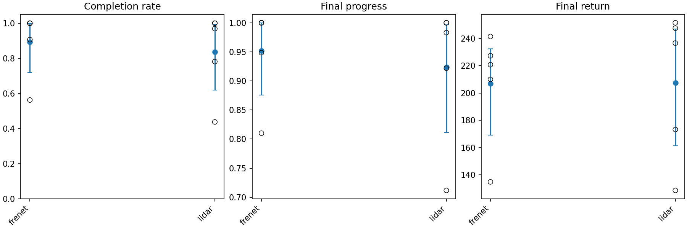
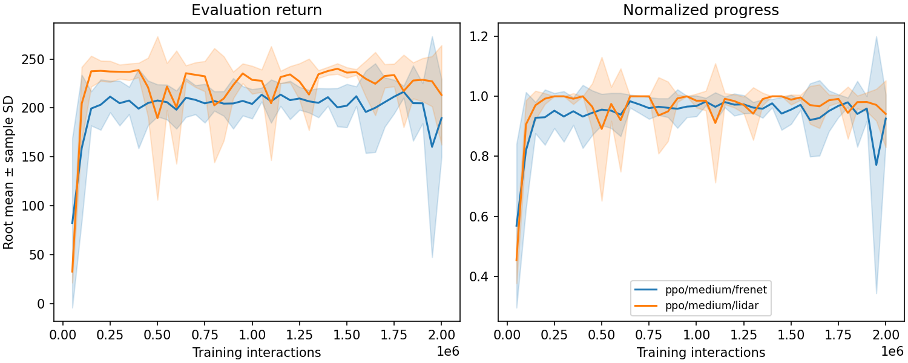
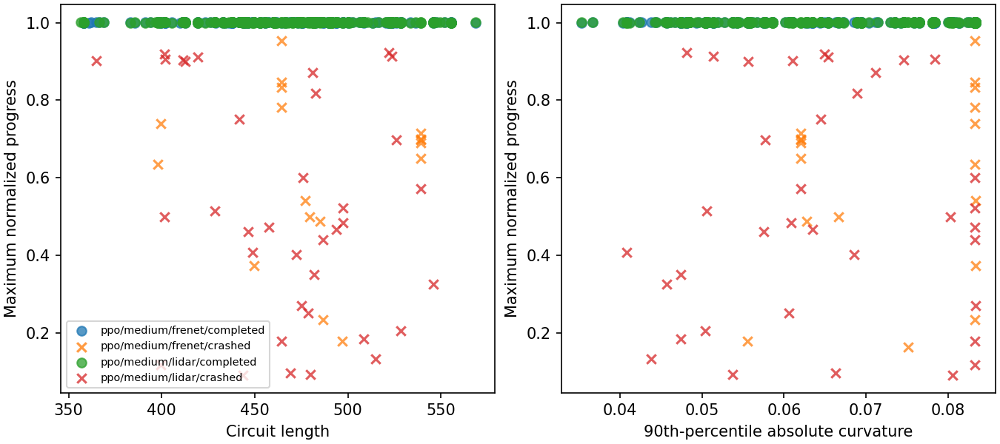
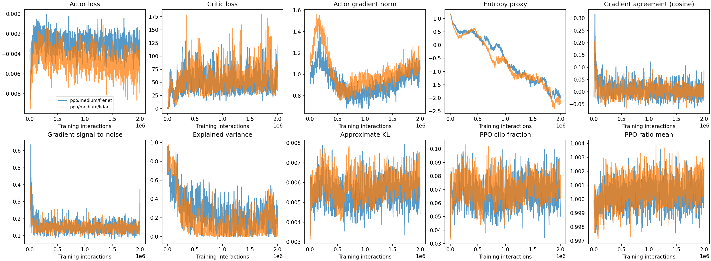

# Experiment 2 — Circuit generalization and observation choice

> How well does the selected PPO actor generalize from procedurally generated
> training circuits to unseen circuits, and how does the Frenet observation
> compare with local LiDAR sensing?

This is the reported outcome of the Experiment 2 section of
[`EXPERIMENT.md`](EXPERIMENT.md). Experiment 1 asked what capacity does on
**one** circuit; this asks what a policy has actually *learned* — whether it
drives this circuit or drives circuits — and whether the answer depends on how
the track is presented to it. Experiment 1's outcome is in
[`EXPERIMENT_1.md`](EXPERIMENT_1.md).

**Status:** complete. 10 runs, 0 failed, 135.8 minutes of wall time.
Reproduce with

```
python experiments/experiment_2.py run
```

**It depends on Experiment 1.** The actor width is not restated here: the script
reads it from Experiment 1's recorded `ppo_actor_selection.json` at the same run
category and fails if that file is absent. Experiment 1 selected the **medium
`(64, 64)`** actor, and that is what all ten runs use. Every table and figure
below is regenerated from the raw run records by `analyze_results`; the files
under `results/analysis/reported_experiments/experiment_2/` are authoritative,
and the figures here are copies kept in `figures/experiment_2/` because
`results/` is not tracked by git.

Two things vary together and must not be confused:

- **Generalization** is a property of one condition: the gap between circuits a
  run trained on and circuits it has never seen.
- **Observation** is the comparison between conditions: Frenet against LiDAR,
  paired within each root.

## Hypotheses

- **Generalization.** PPO trained over generated circuits is expected to retain
  useful performance on unseen generator seeds. The protocol warns that a small
  gap with poor absolute performance is *not* successful generalization but
  uniform failure, so both numbers are always reported together.
- **Observation information.** Frenet is expected to learn faster because it
  exposes track-relative geometry and preview curvature directly. LiDAR must
  infer the same things from 16 ranges and may show a larger efficiency or
  final-performance gap.
- **Track variation.** Both conditions can vary substantially with held-out
  geometry, so per-circuit outcomes accompany every root-level summary.

## Design and splits

One independent training unit is $(\text{observation type}, \text{root
identity})$: two observations times five roots is ten runs. Within each root the
two runs are paired by training-circuit schedule, budget, PPO settings,
validation circuits and test circuits; only their mutable RNG objects differ.

$$
O_t^{\mathrm{Frenet}}=(d_t,\phi_{e,t},v_t,\delta_t,\bar\kappa_t)
\qquad
O_t^{\mathrm{LiDAR}}=(v_t,\delta_t,\widetilde r_t^{(1)},\ldots,\widetilde r_t^{(16)})
$$

Both carry speed and steering angle; **only the track representation differs**.
Neither critic receives privileged information, each condition learns its own
normalization statistics from training only, and LiDAR stays feed-forward
without frame stacking — its partial observability is part of the
interpretation, not a defect.

| Split | Count | Role |
|---|---:|---|
| development | 8 | looked at before the experiment; source of the geometry bin edges |
| training | unbounded | drawn per root and per-worker episode |
| validation | 16 | the learning curve and the convergence rule |
| test | 32 | opened once, after training and selection are complete |
| training-reference | 16 | circuits *this run trained on*, revisited |

Splits are disjoint deterministic namespaces committed in
`tracks/experiment_2_splits.json`, which stores identities and geometry but not
the circuits: they are rebuilt from the frozen generator and re-checked on the
way back in. Pairing is by **worker and per-worker episode count**, never by a
global episode index, because the two observation policies produce episodes of
different lengths.

---

# Result 1 — Parameter counts and circuit exposure

| Condition | Observation dimensions | Actor parameters | Critic parameters |
|---|---:|---:|---:|
| Frenet | 5 | 4,676 | 4,609 |
| LiDAR | 18 | 5,508 | 4,609 |

**Analysis.** Equal hidden widths do not give equal parameter counts, because
the input layer differs: LiDAR carries 832 more actor parameters, 17.8% more.
This is reported rather than removed — equalizing it would mean giving the two
conditions different hidden widths, which would confound the comparison worse
than the input layer does. At 832 parameters the difference is far too small to
explain anything below; Experiment 1 moved actor parameters by $14.5\times$
between medium and large and produced effects of 26 return points, so a 17.8%
change in a layer that only reads the observation is not a plausible mechanism
for a difference of any size found here.

# Result 2 — Primary outcome: held-out test performance

Thirty-two test circuits per run, opened once after training. Means over five
roots.

| Observation | Test completion | SD | Test progress | Test return | Crash rate |
|---|---:|---:|---:|---:|---:|
| Frenet | 0.894 | 0.190 | 0.952 | 206.85 | 0.019 |
| LiDAR | 0.838 | 0.241 | 0.924 | 207.48 | 0.113 |

Per-root test completion:

| Observation | root 0 | root 1 | root 2 | root 3 | root 4 |
|---|---:|---:|---:|---:|---:|
| Frenet | 0.562 | 1.000 | 1.000 | 0.906 | 1.000 |
| LiDAR | 0.781 | 1.000 | 0.438 | 1.000 | 0.969 |



**Analysis.** Both conditions drive unseen circuits well in absolute terms: the
central roots complete 90–100% of 32 held-out circuits with progress above 0.95.
This matters for the Generalization hypothesis, which explicitly warned that a
small gap with poor performance would be uniform failure rather than success.
That is not what happened — performance is high *and*, as Result 3 shows, the
gap is near zero.

The mean difference favours Frenet by 0.056 completion, but **the per-root table
is the honest view and it does not support an observation effect**. Each
condition has exactly one bad root and they are different roots: Frenet's root 0
at 0.562, LiDAR's root 2 at 0.438. The other four roots of each condition sit
between 0.906 and 1.000. With five roots and one outlier apiece, the ranking of
the means is decided by which outlier is worse, not by the observation.

The one asymmetry that does look real is the **crash rate: 0.113 for LiDAR
against 0.019 for Frenet**, six times higher, while mean progress differs by
only 0.028. LiDAR runs fail by crashing; Frenet's rarer failures are more often
timeouts or stalls that still accumulate progress. That is consistent with what
the two observations make available — a LiDAR policy that misreads 16 ranges
puts the car into a wall, while a Frenet policy always knows its signed distance
to the centreline and can be merely slow rather than wrong.

# Result 3 — Generalization: training-reference, validation and test

| Observation | Training-reference | Validation | Test |
|---|---:|---:|---:|
| Frenet completion | 0.887 | 0.787 | 0.894 |
| LiDAR completion | 0.850 | 0.875 | 0.838 |
| Frenet progress | 0.942 | 0.926 | 0.952 |
| LiDAR progress | 0.929 | 0.941 | 0.924 |

Per-root gaps, training-reference minus test:

| Observation | root 0 | root 1 | root 2 | root 3 | root 4 |
|---|---:|---:|---:|---:|---:|
| Frenet | +0.125 | +0.000 | +0.000 | −0.094 | −0.062 |
| LiDAR | +0.031 | −0.062 | +0.062 | +0.000 | +0.031 |

**Analysis.** **There is no generalization gap worth the name.** Test completion
(0.894 Frenet, 0.838 LiDAR) is statistically indistinguishable from performance
on circuits the run actually trained on (0.887, 0.850), and for Frenet the test
split is *nominally easier* than the training-reference split. The per-root gaps
straddle zero in both conditions — five of ten are within ±0.031 — and their
signs are inconsistent across roots.

Read with Result 2's absolute numbers, this is the Generalization hypothesis
confirmed in its strong form: high performance *and* no gap. The policy learned
to drive circuits, not to drive particular circuits. Given that training draws
an unbounded stream of fresh generated circuits, this is the expected outcome
rather than a surprise — the agent never sees the same circuit often enough to
memorize it — but it is worth having measured, because it is what licenses
reading any of these numbers as a statement about driving.

The one irregularity is **Frenet's validation split at 0.787, below both its own
training-reference and test values**, a dip LiDAR does not share. Since the same
16 validation circuits are used by both conditions, this is not a property of
the split alone; it is an interaction between those circuits and the Frenet
runs, and with 16 circuits and 5 roots it is most likely sampling noise. It does
mean the validation-based convergence rule is measuring Frenet on a slightly
unlucky sample, which is worth remembering when reading convergence times.

# Result 4 — The observation comparison, paired within root

The strongest available comparison: each difference is computed on the **same
circuit identity** raced by the two runs of the same root, then summarized.

| Split | Paired circuits | Δ completion | SE | Δ progress | Δ return | SE |
|---|---:|---:|---:|---:|---:|---:|
| Training-reference | 80 | +0.037 | 0.057 | +0.013 | −3.30 | 11.99 |
| Validation | 80 | −0.087 | 0.060 | −0.016 | −23.67 | 11.53 |
| **Test** | **160** | **+0.056** | **0.038** | **+0.028** | **−0.63** | **7.76** |

Run-level paired summary (Frenet − LiDAR), with bootstrap intervals:

| Metric | Mean | 95% interval |
|---|---:|---|
| Final completion rate | +0.056 | −0.131 – +0.325 |
| Final mean progress | +0.028 | −0.067 – +0.166 |
| Final mean return | −0.63 | −36.5 – +52.5 |

Per-root test differences (Frenet − LiDAR):

| root 0 | root 1 | root 2 | root 3 | root 4 |
|---:|---:|---:|---:|---:|
| −0.219 | +0.000 | **+0.562** | −0.094 | +0.031 |

**Analysis.** **The observation comparison is a null result, and the pairing is
what makes that statement trustworthy rather than merely unproven.**

On the test split — the primary outcome, 160 paired circuits — Frenet leads by
0.056 completion against a standard error of 0.038, and by −0.63 in return
against a standard error of 7.76. The return difference is not merely
insignificant; its point estimate is essentially zero and its sign is *opposite*
to the completion difference. Every interval in the run-level table spans zero
comfortably.

The per-root row shows why no amount of extra care rescues a signal here. Root 2
alone contributes +0.562, and roots 0 and 3 lean the other way. **The spread
across roots is an order of magnitude larger than the difference between
conditions.** With five roots, the observation effect — if one exists — is below
this experiment's resolution.

That is a real answer, and it contradicts the Observation-information
hypothesis, which expected Frenet to hold an advantage from exposing
track-relative geometry directly. Sixteen LiDAR ranges, with no frame stacking
and no privileged information, are enough to drive unseen circuits as well as an
explicit Frenet parameterization on this task. The hypothesis was not wrong
about the *mechanism* — Frenet does expose more — but it was wrong that the
exposure would show up in outcomes. What it buys instead appears in Result 2's
crash rate and Result 6's wall-clock cost.

# Result 5 — Validation learning curves and convergence

| Observation | Interactions to convergence, per root |
|---|---|
| Frenet | 150k, 650k, 200k, 100k, 200k |
| LiDAR | 100k, 100k, 150k, 150k, 100k |



**Analysis.** This is the one place the Observation-information hypothesis is not
just unsupported but **reversed**. LiDAR converges in 100k–150k interactions
across all five roots; Frenet takes 100k–650k and is the only condition with a
root needing more than 200k. LiDAR is the more *consistent* learner here, not
the slower one.

The curves show why the endpoint tables look so even. Both conditions reach
their plateau within roughly 150,000–250,000 interactions — the same early-and-
flat shape PPO showed in Experiment 1 — and then spend the remaining 90% of the
budget oscillating rather than improving. LiDAR's band (orange) sits slightly
higher through the middle of training but is also visibly spikier, with sharp
single-checkpoint drops around 0.5M and 1.1M. Frenet's band widens dramatically
at the very end, which is root 0 deteriorating.

Note that the Frenet root needing 650k is root 1, which finishes at 1.000 test
completion — slow convergence here does not predict a bad final policy. Read
alongside Result 3's note that Frenet's validation split is slightly unlucky,
the convergence comparison should be treated as the weakest evidence in this
document: it is measured on 16 circuits through a threshold rule, and both
conditions cross that threshold in well under 10% of the budget.

# Result 6 — Computation

| Observation | End-to-end (min) | Throughput (step/s) | Optimization (min) | Peak memory (MB) |
|---|---:|---:|---:|---:|
| Frenet | 12.1 | 4,860 | 3.0 | 1,621 |
| LiDAR | 14.4 | 4,043 | 3.0 | 1,753 |

**Analysis.** **LiDAR costs 19% more wall time per run, and all of it is in the
environment rather than in learning.** Optimization is 3.0 minutes in both
conditions — identical, as it should be, since the networks differ by 832
parameters and the PPO schedule is the same. The difference is entirely
collection throughput, 4,043 against 4,860 steps per second, which is the cost
of casting 16 rays per step against reading a Frenet frame the simulator already
maintains.

So the observation choice does have a measurable cost; it simply is not a
*learning* cost. Anyone choosing between these representations on this task is
trading roughly 17% of environment throughput and a six-fold higher crash rate
for freedom from a hand-built track parameterization — not for a difference in
how well the policy drives.

Peak memory differs by 132 MB, tracking the wider observation buffers across
eight persistent workers; it is not a constraint at this scale.

# Result 7 — Outcomes stratified by circuit geometry

Test-split evaluations binned by the frozen geometry edges.

| Bin | Frenet completion | LiDAR completion | n per condition |
|---|---:|---:|---:|
| Length 0 (shortest) | 0.900 | 0.833 | 30 |
| Length 1 | 0.829 | 0.829 | 35 |
| Length 2 (longest) | 0.916 | 0.842 | 95 |
| Curvature 0 (mildest) | 0.930 | 0.830 | 100 |
| Curvature 1 | 0.840 | 0.840 | 25 |
| Curvature 2 (tightest) | 0.829 | 0.857 | 35 |



**Analysis.** **Circuit geometry does not predict failure.** Completion is
between 0.83 and 0.93 in every length bin and every curvature bin, for both
conditions, and the longest circuits are completed slightly *more* often than
the middle ones. The scatter plot shows the same thing directly: completions
(the row of markers at 1.0) run the full range of lengths and curvatures, and
crashes are sprinkled underneath them at every geometry rather than clustering
at one end.

The bins do contain the only hint of a systematic observation difference in this
document, and it points in both directions at once. Frenet leads by 0.10 in the
mildest-curvature bin (0.930 against 0.830, the largest n at 100) and trails by
0.028 in the tightest (0.829 against 0.857). A tempting story is that Frenet's
preview curvature helps most where there is little curvature to preview and
LiDAR's direct range sensing helps in tight corners — but with 35 evaluations in
the tightest bin and one outlier root per condition already established, this is
below the resolution of the experiment. It is recorded as an observation, not
claimed as a finding.

The Track-variation hypothesis expected substantial variation with held-out
geometry. What the data shows instead is that variation is substantial **across
roots** and small **across geometry**. Which circuit you draw matters far less
than which random seed trained the policy.

# Result 8 — Optimization diagnostics

Means over the final tenth of each run's updates.

| Observation | Explained variance | Approx. KL | Clip fraction | Actor grad norm | log σ |
|---|---:|---:|---:|---:|---:|
| Frenet | +0.187 | 0.0056 | 0.068 | 1.030 | −0.004 |
| LiDAR | +0.208 | 0.0061 | 0.075 | 1.083 | −0.003 |



**Analysis.** The two conditions are optimizing essentially identically: every
diagnostic matches to within a few percent. Whatever separates Frenet from LiDAR
in this experiment, it is not visible in the optimizer's behaviour.

Two carry-overs from Experiment 1 are confirmed here. **PPO again drives its
exploration noise up to the configured ceiling** — log σ of −0.003 against an
initial −0.5 and an upper clamp of 0.0, so the scale rose from σ ≈ 0.607 to
σ ≈ 1.0 and stopped only because the configuration stopped it. This is now
observed under a completely different training distribution, which strengthens
the reading that it is a property of the algorithm rather than of one task — and
it carries the same caveat as in Experiment 1: **both conditions here are
reported at the edge of their policy class, not at an interior optimum.** Since
the ceiling binds equally on Frenet and LiDAR, it does not threaten the
observation comparison, which is a within-root paired contrast; it limits what
can be said about PPO's absolute performance.

**Explained variance is higher here than in Experiment 1** — 0.19–0.21 against
0.09–0.13 for the same algorithm and actor — despite the task being harder. The
plausible reason is that training across an unbounded stream of circuits gives
the critic a genuinely varied state distribution to fit, where a single circuit
offers a narrow one. It remains low in absolute terms, and PPO drives unseen
circuits at 0.89 completion with it, which reinforces Experiment 1's conclusion
that critic accuracy is not the binding constraint on this task.

Approximate KL of 0.0056–0.0061 stays well below the 0.02 early-stop target and
clip fractions of 7–8% mean the ratio bound is active but not saturating, so the
PPO configuration selected before the experiments is behaving as intended under
multi-circuit training too.

# Verdict on the hypotheses

**Generalization — confirmed in its strong form.** Test completion of 0.894
(Frenet) and 0.838 (LiDAR) on 32 unseen circuits, against training-reference
values of 0.887 and 0.850. High absolute performance *and* a gap indistinguishable
from zero, which is exactly the pairing the protocol demanded before calling
generalization successful.

**Observation information — not supported, and partly reversed.** Frenet was
expected to learn faster and possibly perform better. On 160 paired test
circuits the difference is +0.056 completion (SE 0.038) and −0.63 return (SE
7.76), with per-root swings ten times larger. On convergence LiDAR is if
anything the more consistent, at 100k–150k against Frenet's 100k–650k. The
advantages Frenet does show are a six-fold lower crash rate and 17% better
environment throughput — neither of which is the learning advantage the
hypothesis predicted.

**Track variation — not supported as stated; the variation is elsewhere.**
Completion sits between 0.83 and 0.93 across every length and curvature bin in
both conditions. The substantial variation the hypothesis anticipated from
geometry appears instead across training roots, where a single condition ranges
from 0.438 to 1.000.

# Limitations

- Five roots per condition, and each condition has one outlier root. Every
  comparison of means here is decided by those two roots more than by the
  factor under study; the intervals say so and should be believed.
- The test split is 32 circuits from one frozen generator. "Unseen circuit"
  means unseen *seed*, not unseen *generator* — no conclusion here transfers to
  circuits of a different family, and the generator produces circuits that are
  curved almost everywhere.
- LiDAR is feed-forward with no frame stacking. Its partial observability is a
  deliberate part of the condition, so this is a comparison of *these two
  observations as specified*, not of Frenet parameterization against range
  sensing in general.
- The two conditions have unequal actor parameter counts (4,676 against 5,508)
  because the input dimensions differ. The alternative was unequal hidden
  widths, which would confound more.
- The convergence rule is measured on the validation split, and Frenet's
  validation performance is anomalously below both its training-reference and
  test values. Convergence comparisons between the conditions rest on that
  slightly unlucky sample.
- Both conditions plateau within roughly 10% of the budget, so this experiment
  measures where PPO lands, not how it gets there.
- Both conditions end with PPO's learned exploration scale at its configured
  upper clamp, so the absolute performance reported here is that of a capped
  policy class. The cap binds equally on Frenet and LiDAR and so does not affect
  the paired observation contrast.
